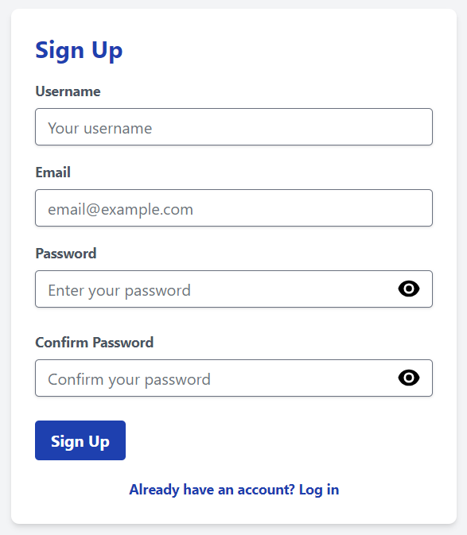
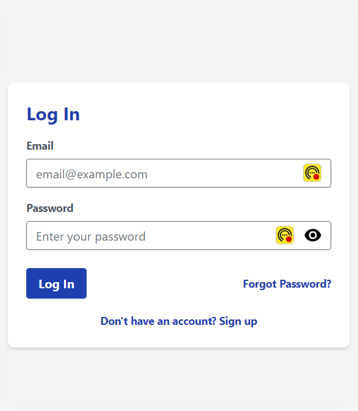
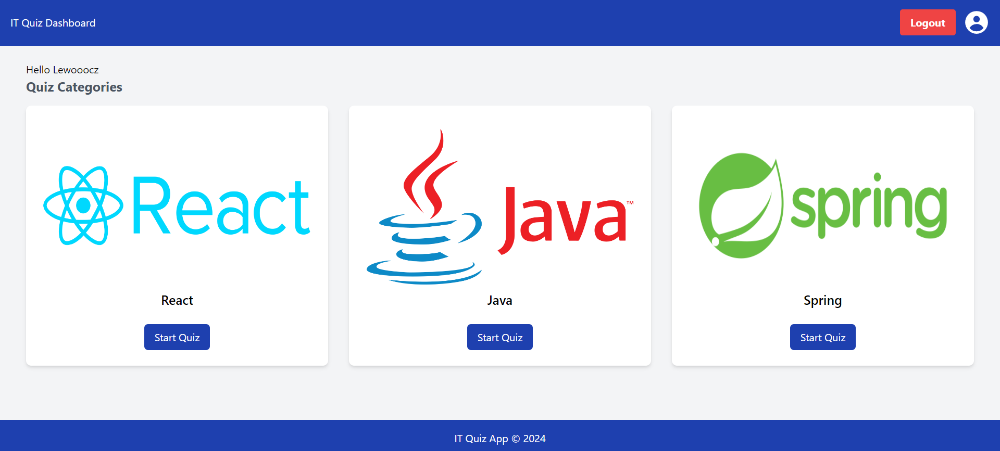
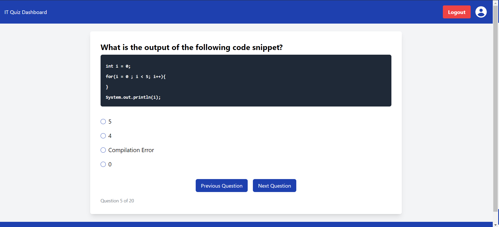

# Quiz App

Quiz App is a web application that allows users to register, log in, and participate in quizzes on various topics such as Java, Spring, and React. After completing a quiz, users can review their answers, and their quiz history is saved for future reference.

## Features
- User Authentication and Authorization - Users can register and log in
- Quiz Participation - Users can choose quizzes from diffrent topics
- Quiz Review - Users can review their quiz results, including correct and incorrect answers
- Quiz History - Users can check their results for each completed quiz

## Frontend Technologies

- **Core Frontend Technologies:**
  - TypeScript
  - React
  - Tailwind CSS

- **UI Components:**
  - @heroicons/react
  - flowbite

- **HTTP Requests:**
  - axios

- **State Management:**
  - react-query
  - zustand

- **Form Handling:**
  - react-hook-form

- **Routing:**
  - react-router-dom

- **Cookie Management:**
  - react-cookie

## Backend Technologies

- **Core Backend Technologies:**
  - Java
  - Spring Framework
  - MySQL

- **Authentication:**
  - JWT (JSON Web Token)

- **Additional Backend Libraries:**
  - Lombok (Java)
  - MapStruct

 ## Screenshots

 
